<picture>
  <source media="(prefers-color-scheme: dark)" srcset="./assets/banner-dark.svg">
  <source media="(prefers-color-scheme: light)" srcset="./assets/banner-light.svg">
  
</picture>

## About me

I'm a **Backend & AI Engineer** focused on building APIs, AI agents, retrieval systems, and software products with **Python and Go**.

At **Educon FGV**, I work on applied AI for commercial and operational workflows, including agents, lead qualification, and **RAG-based knowledge retrieval**. I am also pursuing a degree in **Systems Analysis and Development at UNIP** and expanding my knowledge of model adaptation, machine learning, and distributed systems.

```text
Backend      Python · Go · FastAPI · REST APIs
Applied AI   LLMs · AI Agents · RAG · LangChain
Frontend     React · TypeScript · Tailwind CSS
Data         PostgreSQL · SQLite · Firebase / Firestore
Cloud        Google Cloud Platform
```

---

## AI engineering

| Area | Knowledge and experience |
| --- | --- |
| **Applied AI** | Generative AI · LLM integration · AI agents · prompt engineering |
| **Retrieval** | RAG · embeddings · chunking strategies · chunk size · top-k retrieval |
| **Conversational systems** | Q&A chatbots · transactional chatbots · context and tool orchestration |
| **Frameworks** | LangChain · FastAPI · model and data integrations |
| **Currently studying** | Fine-tuning · LoRA · machine learning fundamentals |

> **In practice:** I use RAG and AI agents in the Edu AI project. Fine-tuning and LoRA are part of my current studies.

---

## Featured projects

### 🤖 Edu AI

Corporate AI platform for customer service, lead reactivation, qualification, and commercial operations. It combines backend services, AI agents, knowledge retrieval, and system integrations in a modular architecture.

`Python` · `FastAPI` · `Go` · `TypeScript` · `React` · `SQLAlchemy` · `LLMs` · `RAG`

**Status:** In development · Corporate project

---

### 💈 MR. Magno SaaS

Booking and management platform for a real barbershop operation, covering scheduling, professionals, services, customers, and internal management.

`React` · `TypeScript` · `Tailwind CSS` · `FastAPI` · `Firebase` · `Firestore`

**Status:** In development

---

### ⚙️ DayForge

Personal productivity system for routines, studies, academic planning, and personal organization, with an emphasis on modular UI architecture and personalized experiences.

`React` · `TypeScript` · `Tailwind CSS`

**Status:** In development

### Labs & experiments

**🐾 PetGo** — Product concept for a local pet-care platform combining clinic discovery, adoption, community, and pharmacy comparison. Focused on product architecture, personas, competitive analysis, and MVP definition.

`FastAPI` · `React` · `TypeScript` · `Tailwind CSS` · `PostgreSQL`

**Status:** Planning & product design

---

## AI system flow

<picture>
  <source media="(prefers-color-scheme: dark)" srcset="./assets/ai-system-flow-dark.svg">
  <source media="(prefers-color-scheme: light)" srcset="./assets/ai-system-flow-light.svg">
  
</picture>

**Indexing knowledge:** extract content from sources, split it into chunks using a chosen size and overlap, generate embeddings, and index the vectors with the original content and metadata.

**Answering a question:** receive the message through the application API, extract or transcribe media when needed, embed the query, and retrieve the top-k relevant chunks from the vector store. The original question, instructions, and retrieved context go to the LLM, which generates the response for the user.

This illustrates a text-based RAG pipeline. Images, audio, and video require suitable extraction, transcription, or a multimodal pipeline. A short question does not normally need chunking. The neural animation is a visual metaphor, not a diagram of the model's internal architecture.

---

## Tech stack

<div align="center">

### Core

[](https://skillicons.dev)

### Backend, data & cloud

[](https://skillicons.dev)

### Frontend

[](https://skillicons.dev)

</div>

---

## Currently

```text
Building     Corporate AI systems and personal software products
Deepening    Go · Backend engineering · LLM systems
Studying     Systems Analysis and Development — UNIP
Exploring    Fine-tuning · LoRA · Machine learning · Distributed systems
Location     Goiânia, Brazil
```

My long-term direction is the intersection of **software engineering, backend systems, and artificial intelligence**, especially products where LLMs solve real operational problems.

---

## Languages

`Portuguese — Native` · `Italian — Fluent` · `English — Intermediate` · `Spanish — Intermediate`

---

## Let's connect

<div align="center">

[](https://www.linkedin.com/in/samueluchoabr1/)
[](https://github.com/SLU-369)

**Building systems where backend engineering meets applied AI.**

</div>
